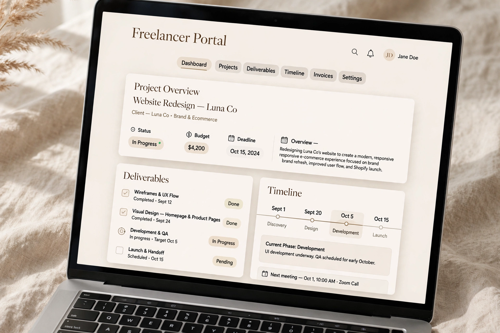
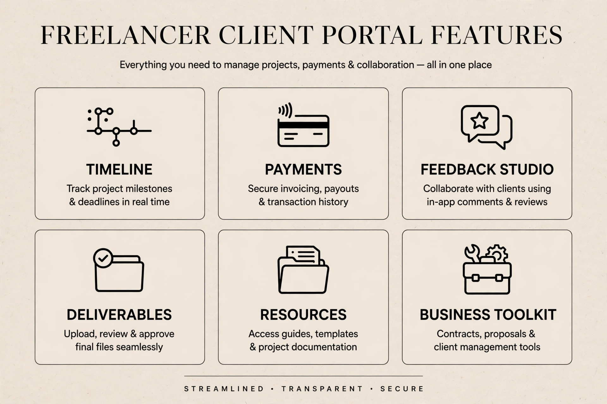
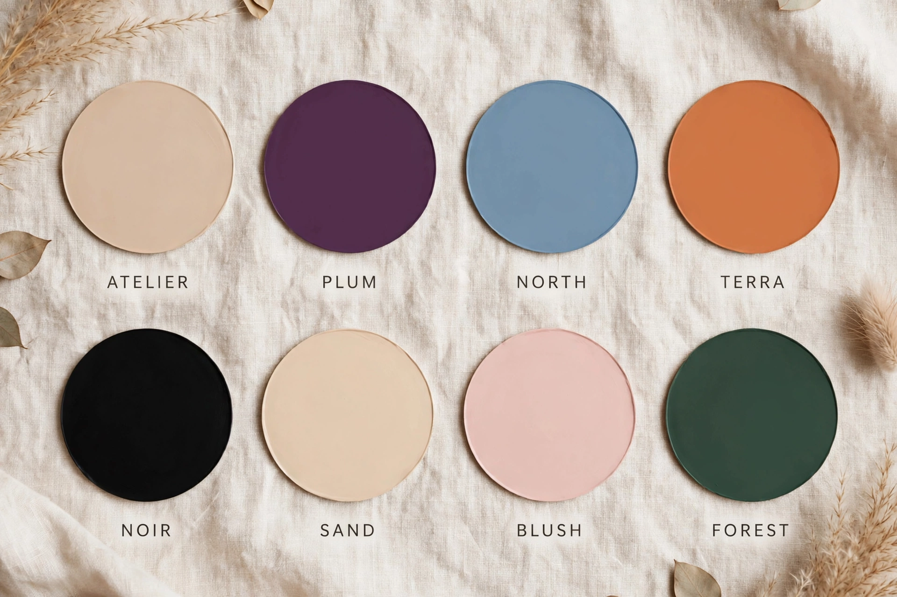
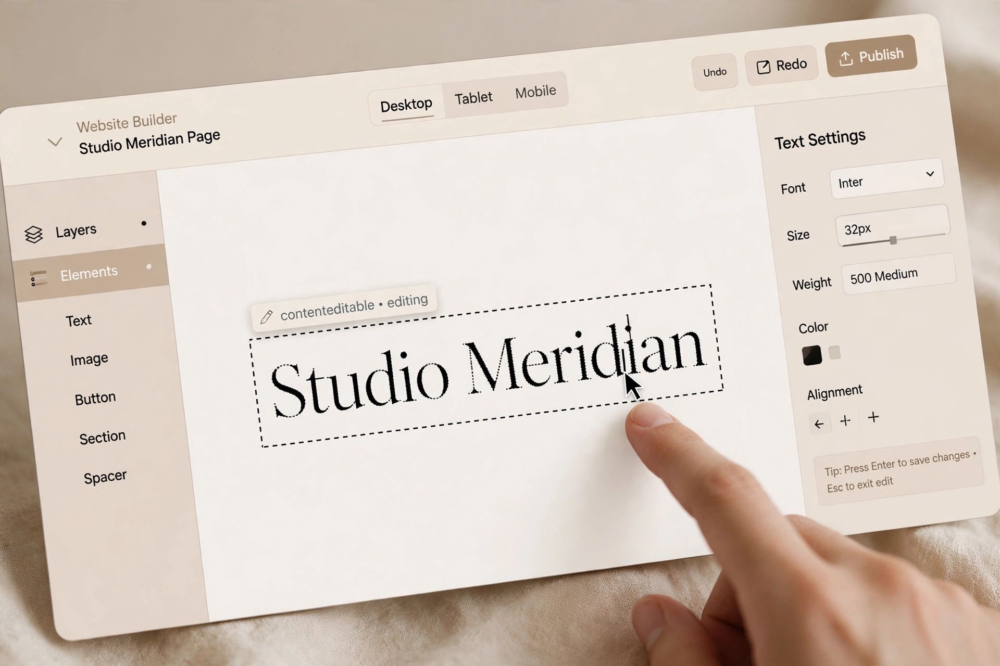
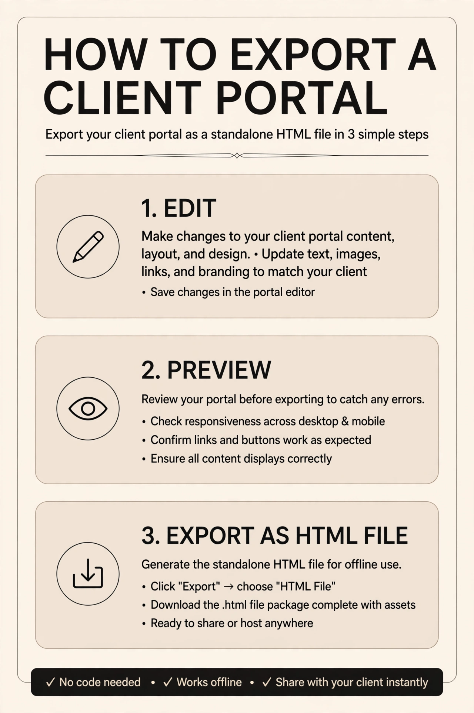

<div align="center">

# — ATELIER —

### `001 — CLIENT PORTAL BUILDER`

**✧ designed by Aditya Pratap ✧**

<br>


<br>

*— a portal that makes clients feel premium —*

**full preview / locked / non-editable**

*this repository is a showcase only*

<br>

[ **@67.aditya_** ](https://instagram.com/67.aditya_) • instagram for editable version

</div>

---

<div align="center">

### ✧ LIVE PREVIEW — FULL VERSION BUT LOCKED ✧



*↑ This is the full portal — all sections visible in this GitHub version, but editing is disabled*

</div>

---

### ⊹  NOTES  —

> This is **not** the editable builder.  
> What you see here on GitHub is the **FULL FEATURE PREVIEW** — every section, every theme, every layout — but locked.
>
> `editing disabled • export disabled • copy protected`  
> Intentionally — to protect the craft while showing the system.

<div align="center">

```
SAMPLE VERSION ONLY — FOR PORTFOLIO
FOR EDITABLE VERSION → DM @67.aditya_ ON INSTAGRAM
```

</div>

---

### — THE SYSTEM —

ATELIER was built for freelancers who are tired of messy Drive links and Notion pages.

One link. One portal. Studio-level experience.

<div align="center">

| 01 | 02 | 03 | 04 |
|---|---|---|---|
| **Overview** | **Deliverables** | **Timeline** | **Feedback Studio** |
| **Payments** | **Resources** | **Wrap-up** | **Thank You** |

</div>

---

### ✦ WHAT YOU GET IN EDITABLE VERSION —

<div align="center">



*Everything you need — Timeline, Payments, Feedback, Deliverables, Resources, Toolkit*

</div>

#### 01 — DESIGN
- 8 themes — ATELIER, PLUM, NORTH, TERRA, NOIR, SAND, BLUSH, FOREST
- 5 layouts — Classic, Editorial, Minimal, Split, Studio
- Custom logo, studio name, tagline, colors

<div align="center">

<br>
<em>8 Editorial Themes — Try them live in the sample (theme dots in top bar work!)</em>
</div>

---

### ✦ HOW TO EDIT — EDITABLE VERSION —

> In the editable version, everything is click-to-edit

<div align="center">



</div>

**How it works:**
1. **Click any text** — studio name, client name, goals, timeline dates, payment amounts
2. **Type directly** — inline editing, just like Notion
3. **Theme dots** — click to switch 8 color themes instantly
4. **Layout buttons** — switch between 5 layouts (Classic / Editorial / Minimal / Split / Studio)
5. **Add / Remove** — add new deliverables, milestones, feedback rounds, resources
6. **Upload images** — in Feedback Studio, add your concepts
7. **Change currency** — $ / ₹ / € / £ — for payments
8. **Auto-saves** — LocalStorage saves, welcome back modal

```diff
+ SAMPLE VERSION = View Only (locked)
+ EDITABLE VERSION = Click Anything To Edit
```

---

### ✦ HOW TO EXPORT — EDITABLE VERSION —

<div align="center">



*3 steps — Edit → Preview → Export as standalone HTML*

</div>

**In editable version:**
- Click **Export Portal** → Downloads as single HTML file
- No backend needed, host anywhere
- Client sees clean portal — no editor controls
- Images embedded, fonts fallback offline

---

### ✦ AESTHETIC — Pinterest Board —

**Mood:** Quiet Luxury, Editorial Minimal, Wabi-Sabi Studio

**Palette:**
```
ATELIER #FFFBF5  •  PLUM #FBF7FF  •  NORTH #F6F8FA  •  TERRA #FFF8F0
NOIR #121212  •  SAND #FDF6E9  •  BLUSH #FFF6F6  •  FOREST #F5F7F4
```

**Typography:**
- Serif: `Instrument Serif` — editorial, timeless
- Sans: `Inter` — clean, modern

**Inspiration:** Kinfolk, Aesop, architectural studios, Japanese editorial

---

### — WHAT YOU CAN DO WITH EDITABLE VERSION —

> **For freelancers & studios who want to look pro**

- ✅ **Impress clients** — Replace Drive links with studio-level portal
- ✅ **Centralize feedback** — No more email chaos, all concepts in one place
- ✅ **Track payments** — Paid / Remaining / Due with multi-currency
- ✅ **Manage timeline** — Done / Active / Upcoming with progress bar
- ✅ **Share resources** — Drive, Figma, staging links in one library
- ✅ **Business toolkit** — Editable policies + email templates (kickoff, revision, handoff)
- ✅ **One-click client handoff** — Export clean HTML, send link, done
- ✅ **Unlimited clients** — Duplicate for each client

---

<div align="center">

### — FULL PREVIEW INCLUDES —

`✓ All 9 sections visible`
`✓ All 8 themes switchable`
`✓ All 5 layouts switchable`
`✕ Editing disabled (sample only)`
`✕ Export disabled (sample only)`

*You can see everything — you just can't edit it here.*

---

### ✧ WANT TO EDIT? ✧

This GitHub version is locked to protect the design.

For the **fully editable, unlocked builder** — where you can edit everything and export for your clients:

## DM me on Instagram

### 👉 [@67.aditya_](https://instagram.com/67.aditya_)

> Message: *"Hi Aditya, I need ATELIER editable version"*

I'll send you the full source + license.

</div>

---

### — HOW TO USE SAMPLE —

1. Clone / download repo
2. Open `index.html` — full locked preview
3. Try theme dots & layout buttons (top bar) — they still work for demo
4. Try to edit text — it's locked, that's intentional
5. Like it? Get editable version → Instagram

```bash
git clone https://github.com/yourusername/atelier.git
open index.html
```

---

<div align="center">

### — CRAFTED BY —

## Aditya Pratap

Frontend Designer • Portal Systems • Freelance Tools
India — 2026

**Instagram — [@67.aditya_](https://instagram.com/67.aditya_)**

*If you vibe with the design, please leave a ⭐*

---

### — LICENSE —

© Aditya Pratap — 2026
Sample version for portfolio only.
Do not resell, redistribute, or claim as own.
For commercial license / editable version → contact designer.

---

*— built slowly, with intention —*
*ATELIER — 001*

</div>
